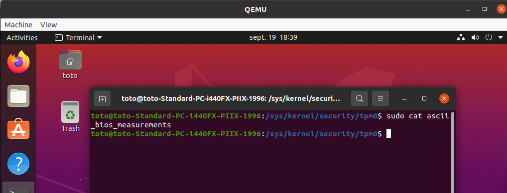
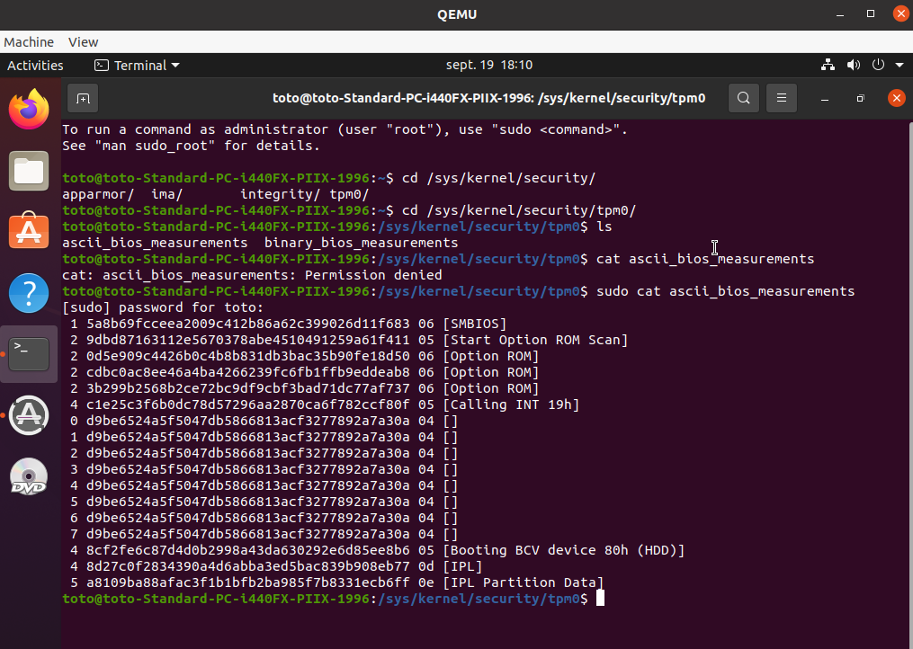

# Description

Investigate TPM measurement under Qemu with OVMF+swtpm.


# Setup

## Setup VM

```
sudo apt install qemu qemu-utils qemu-kvm virt-manager libvirt-daemon-system libvirt-clients bridge-utils

sudo usermod -a -G libvirt $USER
sudo usermod -a -G dnsmasq $USER #never work for me
sudo usermod -a -G libvirt-qemu $USER
```

## Setup swtpm
```
# libtpms is required by swtpm
git clone https://github.com/stefanberger/libtpms
cd libtpms \
	./autogen.sh --with-tpm2 --with-openssl --prefix=/usr \
	&& make \
	&& make check \
	&& sudo make install
	&& cd ..

# required by swtpm
sudo apt install -y gawk gnutls-bin libgnutls28-dev libgmp-dev libjson-glib-dev libssl-dev libtasn1-6-dev  net-tools python3-twisted socat softhsm2 libseccomp-dev

# install swtpm
git clone https://github.com/stefanberger/swtpm.git
cd swtpm \
	&& ./autogen.sh --prefix=/usr \
	&& make \
	&& make check \
	&& sudo make install \
	&& cd ..

```

# Setup working directory

```
VMDIR=/tmp/vmdir
IMG=ubuntu-20.04.3-desktop-amd64.iso

mkdir -p ${VMDIR}/mytpm0
cd ${VMDIR}
wget https://releases.ubuntu.com/20.04/$IMG
```

## OVMF
```
swtpm socket --tpmstate dir=${VMDIR}/mytpm0 --ctrl type=unixio,path=${VMDIR}/mytpm0/swtpm-sockw &
# I had issue will installing ubuntu with gcow format
qemu-img create ubuntu.img 20G
sudo qemu-system-x86_64 \
     -cpu host \
     -enable-kvm \
     -m 1024 \
     -bios /usr/share/ovmf/OVMF.fd \
     -drive format=raw,file=${VMDIR}/ubuntu.img \
     -chardev socket,id=chrtpm,path=${VMDIR}/mytpm0/swtpm-sockw \
     -tpmdev emulator,id=tpm0,chardev=chrtpm -device tpm-tis,tpmdev=tpm0 \
     -cdrom ${IMG}
# Install and reboot and when the following message appear then stop QEMU
# "Please remove the installation medium, then press ENTER"
```

Now we can re-run qemu without `-cdrom ${IMG}` and we can't read TPM measurement from `/sys/kernel/security/tpm0/ascii_bios_measurements`




## Seabios
```
swtpm socket --tpmstate dir=${VMDIR}/mytpm0 --ctrl type=unixio,path=${VMDIR}/mytpm0/swtpm-sockw &
qemu-img create -f qcow2 ubuntu.qcow 20G
sudo qemu-system-x86_64 \
     -cpu host \
     -enable-kvm \
     -m 1024 \
     -drive file=ubuntu.qcow \
     -chardev socket,id=chrtpm,path=${VMDIR}/mytpm0/swtpm-sockw \
     -tpmdev emulator,id=tpm0,chardev=chrtpm -device tpm-tis,tpmdev=tpm0 \
     -cdrom ${IMG} \
# Install and reboot and when the following message appear then stop QEMU
# "Please remove the installation medium, then press ENTER"
```
Now we can re-run qemu without `-cdrom ${IMG}` and we can read TPM measurement from `/sys/kernel/security/tpm0/ascii_bios_measurements`




## Analyses

There is clealy a bit differences between this logs but I don't know why OVMF don't have TPM Measurements

# Next steps

 * Follow this https://www.mail-archive.com/edk2-devel@lists.01.org/msg01636.html

# Sources
 * https://bkjaya.wordpress.com/2020/04/27/how-to-install-qemu-on-ubuntu-20-04-lts-focal-fossa/
 * https://community.juniper.net/answers/blogs/elevate-member/2020/12/22/whats-the-difference-between-secure-boot-and-measured-boot
 * https://www.ubuntubuzz.com/2021/04/how-to-boot-uefi-on-qemu.html
